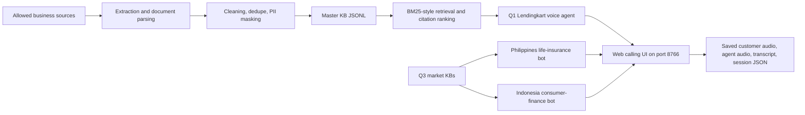

# Architecture - Tasks 1, 2, and 3

## Scope

This repo contains:

- Q1: Knowledge-grounded Lendingkart business-loan voice agent.
- Q2: Structured, searchable, cited knowledge base.
- Q3: Localized Philippines and Indonesia financial voice bots.

Q4 live insights is split into a different repo because it has its own panel and streaming-nudge pipeline.

## Architecture

## Key Design Choices

### JSONL as the source of truth

The KB uses JSONL because it is readable, versionable, and easy to audit. A vector database can be added later as an index, but it should not become a separate uncontrolled knowledge source.

### BM25/keyword retrieval first

Business-loan answers often depend on exact terms such as `processing fee`, `CIBIL`, `GST`, `tenure`, and `foreclosure`. Keyword retrieval is more transparent for the assessment than a broad semantic index.

### Web calling instead of phone integration

The assessment allows a web calling interface. This keeps the demo local and reliable while still showing microphone input, STT, grounded response, TTS, transcripts, and saved session artifacts.

### Separate Q3 market components

Philippines and Indonesia use separate components and KB files so localization is not just translation. Each market has its own terminology, tone, fallback, and response registers.

## Future Improvements

- Add hybrid BM25 + vector retrieval over the same JSONL KB.
- Add human approval workflow for KB records with warnings.
- Add Twilio/WebRTC call transport.
- Add native Filipino and Indonesian neural TTS.
- Add native-speaker and compliance review.

